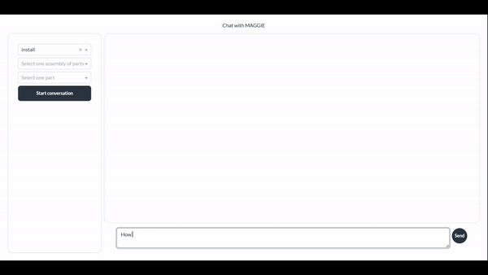

# MAGGIE - MAintenance Generative Guide for Industrial Efficiency

TIP Group is pleased to introduce *MAGGIE*!

Check out the official demo [at this link](https://youtu.be/RffJoNJlioE).

## 1. Project description
### What is MAGGIE?
**MAGGIE** (**MA**intenance **G**enerative **G**uide for **I**ndustrial **E**fficiency) is a cutting-edge digital assistant specifically designed to revolutionize the repair and maintenance workflows in the automotive industry, particularly for mechanics working in complex environments like TIP workshops. 
For companies like TIP, which service *thousands of trailers* across Europe, the inefficiencies in repair workflows lead to increased labor costs, longer repair times, and reduced customer satisfaction. MAGGIE addresses all these issues by providing mechanics with instant access to the exact tools, parts, and step-by-step instructions needed to complete repairs, installations and replacements. 
This allows businesses to: 
1. **Increase** throughput by servicing more vehicles in less time. 
2. **Reduce** the reliance on seasoned mechanics by providing apprentices with precise guidance. 
3. **Minimize** safety risks associated with incorrect repairs, ensuring compliance with industry standards. 

### How does MAGGIE work? 
MAGGIE combines indeed **generative AI** and **computer vision** to dynamically provide context-aware guidance, simplifying and accelerating manual searches through large documents and inventory management. 
To do so, it follows these steps:
1. It pre-processes maintenance manuals of trailer components in PDF format by chunking them into manageable and searchable units.
2. It enables accurate identification of parts needed for workshop activities by identifying QR codes in the documents with *OpenCV* and then scraping the links they reference to extract data for parts related to each component. 
3. It then combines all of the above with Meta's *LLama 3.1 70b Instruct* to deliver relevant content based on mechanics' queries and tailored to specific scenarios, manufacturers, and tasks. 

Furthermore, the custom UI makes the user experience much easier by allowing mechanics to interact with MAGGIE either through natural language queries or via pre-structured prompts, ensuring accessibility for all experience levels. 

MAGGIE’s architecture is built for **scalability** and **modularity**, ensuring that the solution can grow with the business and accommodate new features without requiring extensive rewrites. 
The design leverages: 
- **Databricks Autoloader** for continuous ingestion of new documents, allowing the system to handle increasing data volumes without the need to write new code. 
- **Delta Lake** and **Vector Search** for efficient querying, making it easy to retrieve relevant information even if the data volume scales. 
- **MLflow** and **Mosaic AI Agent Framework** for model scalability, deployment, and governance, allowing MAGGIE to ensure continuous quality. 
- **Databricks Model Serving** to allow the model to be invoked as a low-latency API on a highly available serverless service, guaranteeing high throughput at low costs. 
- **Databricks Apps** for an easily-deployable UI through automatic provisioning of serverless compute, offering built-in governance with Unity Catalog and secure user authentication.

Each component is encapsulated within a *Databricks Asset Bundle*, making it easy to update and redeploy the system without significant downtime or codebase restructuring. This modular approach ensures that the system can be adapted to new assets, manufacturers, or repair procedures with minimal effort, driving down costs as the system scales.

### What are MAGGIE's features?
- **User-Friendly Interaction**: Mechanics can interact with MAGGIE through a chat interface by either selecting options from dropdowns or writing a free-form text. For example, they can request assistance by saying: “Give me assistance to replace the brake pad (code 12345) from BPW on a trailer.”
- **Real-Time, Specific Repair Guidance**: MAGGIE delivers a list of all necessary tools and parts, alongside step-by-step guidance on how to perform the requested task, ensuring that even apprentices can follow along safely and accurately.
- **Embedded Resources**: MAGGIE's answers include links to relevant source materials and images to support the mechanic during the maintenance process.
- **Scalable and Cost-Efficient Architecture**: The solution leverages Databricks’ suite of tools to handle high volumes of data and requests while preserving low latency and costs.

## 2. Technical guide
### How to deploy & run
Refer to the official documentation on [how to deploy and run a Databricks Asset Bundle](https://docs.databricks.com/en/dev-tools/bundles/python-wheel.html).

### Explanation of the repo structure
The main code is in `/src/MAGGIE`, which has the following structure:

*root (/src/MAGGIE)* \
|-`autoloader.py`: reads files from source and uploads them to Unity Catalog \
|-`deployment.py`: supports model deployments \
|-`main.py`: entrypoint where the main flow is defined \
|-`preprocessing.py`: contains all the custom functions used to pre-process data \
|-`prompt.py`: contains all the textual prompts to instruct each model \
|-`utils.py`: defines variables and hyperparameters \
|-`vector_search.py`: creates and deploys Vector Search Index

The code used to build the UI can be found in the folder `dash_ui`, which is then easily deployable through Databricks Apps. 

Databricks job definitions can be found in `databricks.yml` and in `/resources/MAGGIE_job.yml`.

The folder `scratch` contains the notebooks used during the early development stage as well as those used for the evaluation of the whole application, therefore PLEASE REFER TO IT IN CASE OF FAILURES WHEN RUNNING THE MAIN CODE.

### Credits
This project was realized for the [2024 GenAI World Cup](https://hackathon.stackup.dev/web/events/generative-ai-world-cup-2024-so-you-think-you-can-hack) hosted by Databricks.

#### Authors
- Stefano D'Angelo\
*Github*: [stefanodangelo](https://github.com/stefanodangelo)
- Hugo Martins\
*Github*: [hrfmartins](https://github.com/hrfmartins)
- Nicolas Amodeo\
*Github*: [n-bradley](https://github.com/n-bradley/)